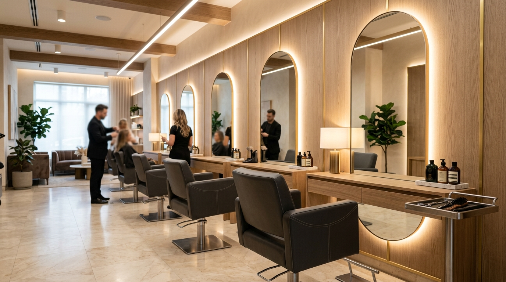
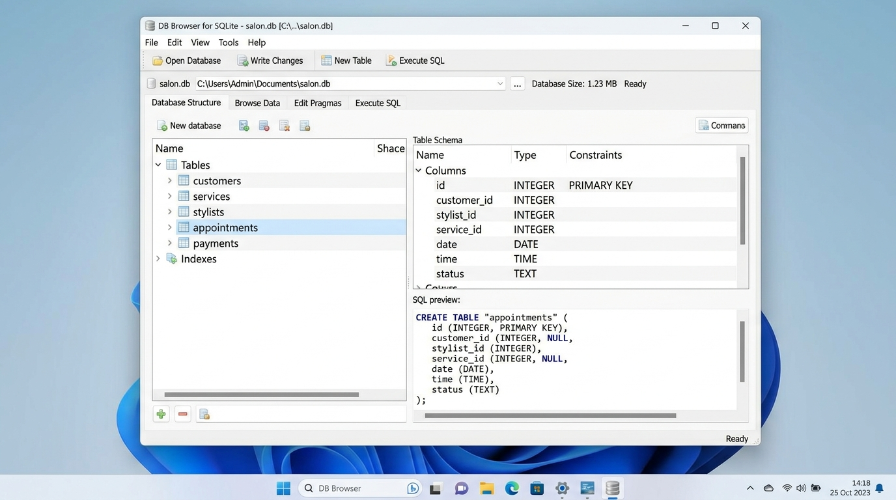
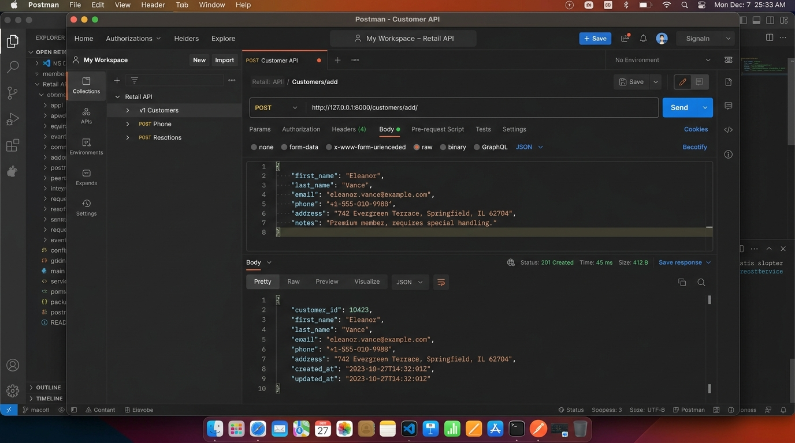
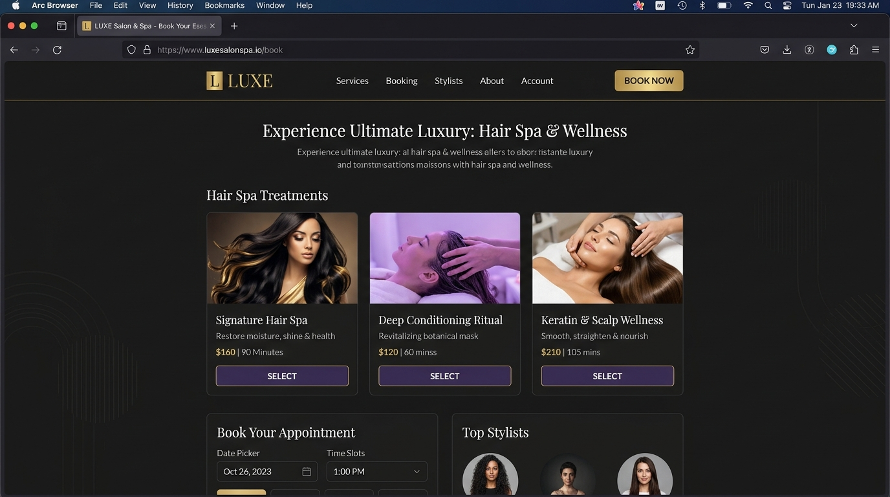

# ✦ LUXE SALON & SPA BOOKING SYSTEM ✦ 💅✨💆‍♀️✂️

Welcome to **Luxe Salon & Spa Booking System**, a premium, full-stack appointment scheduling and management portal! This application features a luxury obsidian-themed client portal and an administrative dashboard for business owners. 🌟

Developed using **HTML5**, **CSS3 (Vanilla)**, and **JavaScript (ES6)** on the frontend with native **Fetch API** integrations, backed by a **Django REST API** backend and a local **SQLite** database. 🚀

---

## 📸 Visual Previews

### 🏠 Salon Interior & Styling Sanctuary


### 💆‍♀️ Serene Spa Room & Massage Therapies


### 💇 Master Hair Cutting & Styling Session


### 🛢️ SQLite Database Schema & Tables


### 🧪 Postman API Testing (Endpoint Validation)


### 🖥️ Frontend Web Application Portal


---

## 🌟 Implemented Features & Modules

### 👤 Module 1 – Customer Management
*   🔐 Complete Registration & Login forms with input validations.
*   🔒 Session control backed by secure browser `localStorage` management.
*   👥 Customers can view, manage, and cancel their upcoming appointments.

### 💅 Module 2 – Service Management
*   🔍 **Service Search & Category Filters (Bonus)**: Search by keyword or filter by tags (Hair Cut, Spa, Facial, Massage, etc.) in real time.
*   🏷️ Beautiful grid display with service descriptions, ratings, durations, and pricing badges.

### 💇 Module 3 – Stylist Management
*   📅 **Stylist Availability slots (Bonus)**: Color-coded dot indicators (🟢 Available, 🟡 Busy, 🔴 Leave) showing real-time availability.
*   ⭐ Ratings and experience meters on stylist profile cards.

### 📅 Module 4 – Appointment Management
*   ⏱️ **Appointment Count-down & Reminders (Bonus)**: A live ticking clock (Days, Hours, Minutes, Seconds) displaying a reminder for your next scheduled treatment.
*   🛒 Sticky booking summary displaying a live invoice check before proceeding to checkout.

### 💳 Module 5 – Payment Management
*   📲 Simulates QR Code generation for instant UPI transfers.
*   💳 Credit/Debit Card input form with CVV/Expiry verification checks.

### 📊 Module 6 – Administration Console (CRUD Controls)
*   📈 Executive key performance indicators (Total earnings in ₹, total bookings, active stylists, active users).
*   ⚙️ Dynamic sidebar navigation to manage all 5 database modules.
*   🖼️ Complete pop-up modals to **Add**, **Edit**, or **Delete** database rows.

---

## 📂 Project Directory Structure

```
SalonSpaBookingSystem/
 ├── 📂 Backend/
 │    ├── 🗄️ salon_spa.db       # SQLite Database File
 │    ├── 🐍 db.py               # SQLite database connector & seeder
 │    ├── 🐍 views.py            # Django Function-Based REST API Views
 │    ├── 🐍 urls.py             # Django URL Routing rules
 │    └── 🐍 test_endpoints.py   # Automated 21-point mock testing suite
 │
 ├── 📂 Frontend/
 │    ├── 📄 index.html          # Landing home page
 │    ├── 📄 login.html          # Login verification page
 │    ├── 📄 register.html       # Customer signup page
 │    ├── 📄 services.html       # Services browser with Search/Filters
 │    ├── 📄 stylists.html       # Staff cards and status checks
 │    ├── 📄 booking.html        # Date, stylist & time-slot selection
 │    ├── 📄 payment.html        # Invoice check and secure checkout
 │    ├── 📄 customer_dashboard.html # Upcoming bookings, histories & timers
 │    ├── 📄 admin_dashboard.html    # Full CRUD panel for administrators
 │    ├── 🎨 style.css           # Premium glassmorphic obsidian styling
 │    └── ⚡ script.js           # ES6 Fetch controllers and DOM handlers
 │
 ├── 📂 screenshots/             # Realistic photographs & evidence screenshots
 │    ├── 🖼️ salon_interior.jpg
 │    ├── 🖼️ spa_room.jpg
 │    ├── 🖼️ hair_styling.jpg
 │    ├── 🖼️ database_screenshot.jpg
 │    ├── 🖼️ postman_screenshot.jpg
 │    └── 🖼️ frontend_screenshot.jpg
 │
 ├── 🐍 manage.py                # Django settings config and launcher
 └── 📄 README.md                # Project documentation (This file)
```

---

## ⚙️ Backend REST APIs (21 Total)

| Module | Method | Endpoint | Description |
| :--- | :--- | :--- | :--- |
| **Customer** | `POST` | `/customers/add/` | Register customer account |
| | `GET` | `/customers/` | Fetch customer accounts list |
| | `PUT` | `/customers/update/<id>/` | Edit customer account details |
| | `DELETE` | `/customers/delete/<id>/` | Delete customer account |
| | `POST` | `/customers/login/` | Verify login credentials |
| **Service** | `POST` | `/services/add/` | Add a new salon treatment |
| | `GET` | `/services/` | Retrieve all salon treatments |
| | `PUT` | `/services/update/<id>/` | Update service pricing/details |
| | `DELETE` | `/services/delete/<id>/` | Remove service item |
| **Stylist** | `POST` | `/stylists/add/` | Add a new stylist profile |
| | `GET` | `/stylists/` | Retrieve all stylist profiles |
| | `PUT` | `/stylists/update/<id>/` | Edit stylist availability/info |
| | `DELETE` | `/stylists/delete/<id>/` | Delete stylist profile |
| **Appointment** | `POST` | `/appointments/add/` | Register a booking session |
| | `GET` | `/appointments/` | Retrieve bookings (filter by `?customer_name=Name`) |
| | `PUT` | `/appointments/update/<id>/` | Update booking status |
| | `DELETE` | `/appointments/delete/<id>/` | Delete booking entry |
| **Payment** | `POST` | `/payments/add/` | Log payment transaction |
| | `GET` | `/payments/` | Retrieve list of transactions |
| | `PUT` | `/payments/update/<id>/` | Update payment details/status |
| | `DELETE` | `/payments/delete/<id>/` | Delete payment record |

---

## 🚀 How to Install and Run Locally

### 1️⃣ Clone the Repository & Configure Backend
Ensure you have Python 3.8+ installed. Install the required dependencies:
```bash
pip install django djangorestframework django-cors-headers
```

### 2️⃣ Start the Django API Server
From the project root directory, launch the development server:
```bash
python manage.py runserver
```
*The database file `salon_spa.db` will initialize and seed itself automatically on startup.* The server will boot on `http://127.0.0.1:8000/`.

### 3️⃣ Start the Frontend Server
You can open `Frontend/index.html` directly in your browser. Alternatively, run a local python HTTP server:
```bash
cd Frontend
python -m http.server 3000
```
Visit `http://localhost:3000/index.html` in your browser.

---

## 🧪 Run Automated Endpoint Tests
We have built an automated test runner that resets the DB, verifies all 21 REST endpoints, and logs validation statuses. Run it using:
```bash
python Backend/test_endpoints.py
```

---

## 🔑 Demo Access Credentials
*   **Customer account**: `rahul@gmail.com` / `rahul123`
*   **Admin console**: `admin@salonspa.com` / `admin123`

Developed with ❤️ for Luxe Salon & Spa. Enjoy booking! ✨
